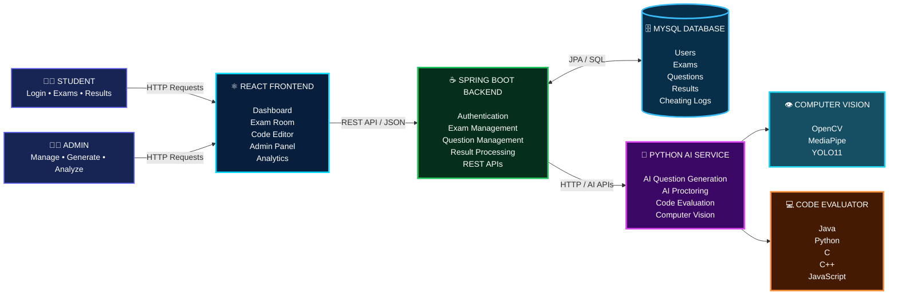
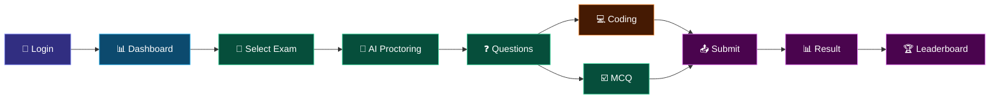
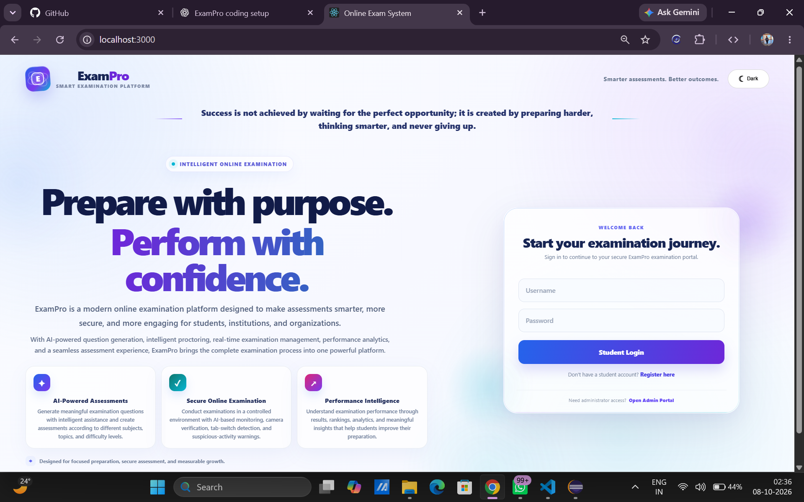
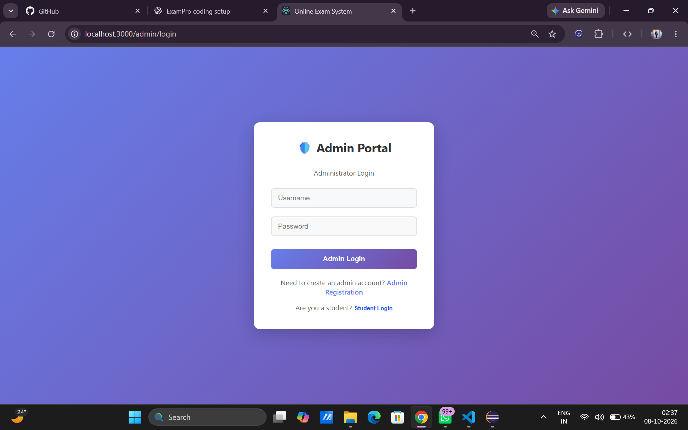
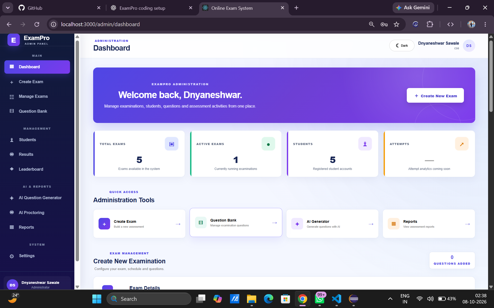
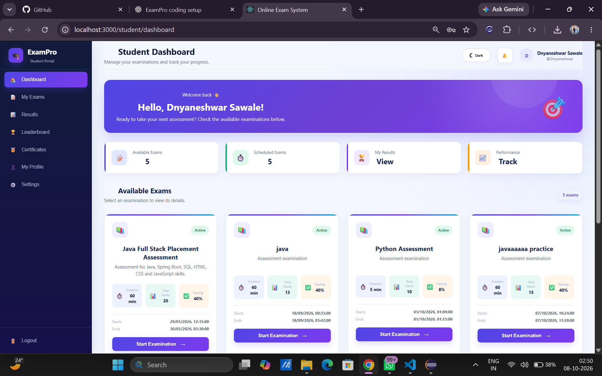
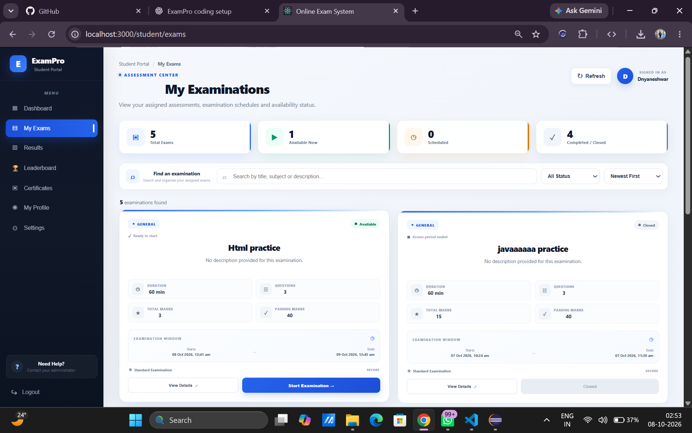
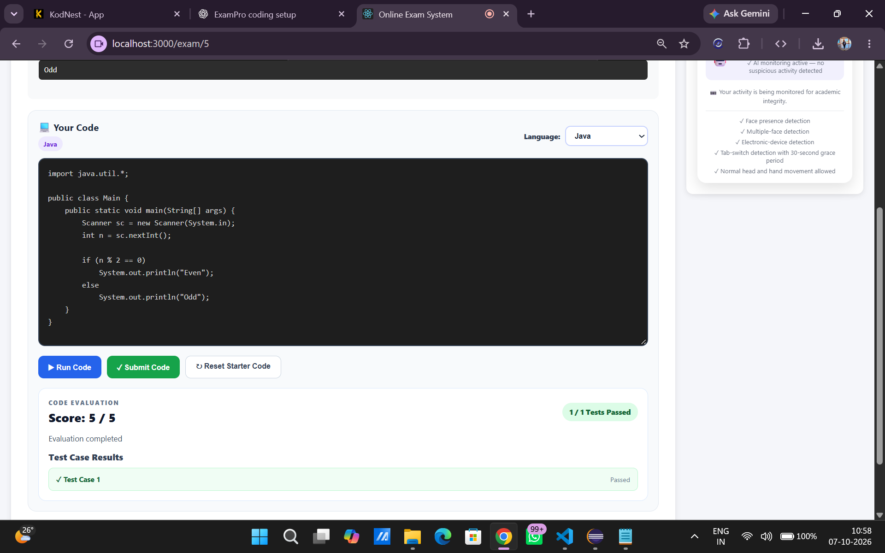
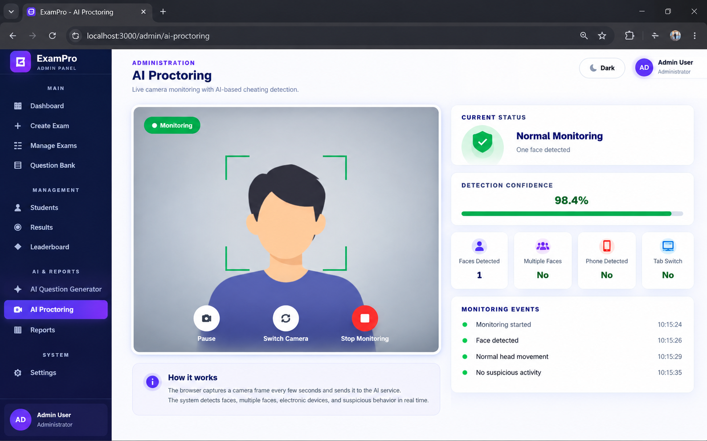

<div align="center">


<br>


<br><br>


<br>


<br><br>

<p>
<b>🚀 A complete full-stack examination platform combining Web Development, Artificial Intelligence, Computer Vision and Automated Code Evaluation.</b>
</p>

</div>

---

<div align="center">

# ✨ EXAMPRO ECOSYSTEM

<i>Everything required to conduct secure, intelligent and modern online examinations.</i>

</div>

<br>

<!--
GitHub README does not allow custom CSS :hover effects.
These cards are therefore built with GitHub-compatible HTML and colored
visual elements so they keep the intended card appearance on GitHub.
-->

<table>
<tr>

<td width="25%" align="center" valign="top">

<br>


<h2>🧠 AI PROCTORING</h2>

<hr>

<p>
<b>AI-powered examination monitoring using computer vision.</b>
</p>

<br>

<table>
<tr><td align="center">👤 <b>Face Detection</b></td></tr>
<tr><td align="center">👥 <b>Multiple Face Detection</b></td></tr>
<tr><td align="center">📱 <b>Device Detection</b></td></tr>
<tr><td align="center">⚠️ <b>Cheating Detection</b></td></tr>
</table>

<br>


<br><br>

</td>

<td width="25%" align="center" valign="top">

<br>


<h2>💻 CODING EVALUATION</h2>

<hr>

<p>
<b>Automated programming examination and code evaluation.</b>
</p>

<br>

<table>
<tr><td align="center">▶️ <b>Run Code</b></td></tr>
<tr><td align="center">🧪 <b>Test Cases</b></td></tr>
<tr><td align="center">🔍 <b>Output Matching</b></td></tr>
<tr><td align="center">📊 <b>Automatic Scoring</b></td></tr>
</table>

<br>


<br><br>

</td>

<td width="25%" align="center" valign="top">

<br>


<h2>📝 EXAM MANAGEMENT</h2>

<hr>

<p>
<b>Complete examination management for administrators and students.</b>
</p>

<br>

<table>
<tr><td align="center">➕ <b>Create Exams</b></td></tr>
<tr><td align="center">☑️ <b>MCQ Questions</b></td></tr>
<tr><td align="center">💻 <b>Coding Questions</b></td></tr>
<tr><td align="center">📚 <b>Question Bank</b></td></tr>
</table>

<br>


<br><br>

</td>

<td width="25%" align="center" valign="top">

<br>


<h2>📊 ANALYTICS</h2>

<hr>

<p>
<b>Monitor examination performance and student results.</b>
</p>

<br>

<table>
<tr><td align="center">📈 <b>Results</b></td></tr>
<tr><td align="center">🏆 <b>Leaderboard</b></td></tr>
<tr><td align="center">🎯 <b>Performance</b></td></tr>
<tr><td align="center">📄 <b>Reports</b></td></tr>
</table>

<br>


<br><br>

</td>

</tr>
</table>

---

# 🏗️ SYSTEM ARCHITECTURE

<div align="center">

### ⚡ Interactive Architecture Overview

The architecture below shows how the frontend, backend, database and AI services communicate.

</div>



---

# 🔄 COMPLETE SYSTEM FLOW

<div align="center">

<table>
<tr>

<td align="center" width="20%">

### 👨‍🎓

**STUDENT**

Login  
↓  
Dashboard  
↓  
Select Exam

</td>

<td align="center" width="20%">

### 📝

**EXAM**

MCQ  
+  
Coding

</td>

<td align="center" width="20%">

### 🤖

**AI**

Proctoring  
Question Generation

</td>

<td align="center" width="20%">

### ⚙️

**PROCESSING**

Evaluation  
Test Cases  
Scoring

</td>

<td align="center" width="20%">

### 📊

**RESULT**

Marks  
Leaderboard  
Analytics

</td>

</tr>
</table>

</div>

---

# ⭐ KEY FEATURES

<div align="center">

<table>
<tr>

<td width="25%" align="center">

### 🧠

## AI QUESTION GENERATION

Generate examination questions according to:

`Topic`

`Difficulty`

`Question Type`

`Question Count`

</td>

<td width="25%" align="center">

### 🛡️

## AI PROCTORING

Detect suspicious activities using:

`MediaPipe`

`OpenCV`

`YOLO11`

</td>

<td width="25%" align="center">

### 💻

## CODING EXAMINATION

Programming environment with:

`Starter Code`

`Run Code`

`Submit Code`

`Test Cases`

</td>

<td width="25%" align="center">

### 📈

## PERFORMANCE ANALYTICS

Analyze:

`Results`

`Leaderboard`

`Marks`

`Performance`

</td>

</tr>
</table>

</div>

---

# 🤖 AI PROCTORING ENGINE

<div align="center">

```text
                         📷 WEBCAM
                            │
                            ▼
                  ┌──────────────────┐
                  │ COMPUTER VISION  │
                  └────────┬─────────┘
                           │
              ┌────────────┼────────────┐
              │            │            │
              ▼            ▼            ▼
          👤 FACE       👥 MULTIPLE    📱 DEVICE
         DETECTION        FACES       DETECTION
              │            │            │
              └────────────┼────────────┘
                           ▼
                    ⚠️ DETECTION ENGINE
                           │
                           ▼
                    📝 CHEATING LOG
```

</div>

<table>
<tr>

<td width="33%" align="center">

### 👤 FACE MONITORING

Detects whether the student is present during the examination.

</td>

<td width="33%" align="center">

### 👥 MULTIPLE FACES

Detects the presence of more than one person.

</td>

<td width="33%" align="center">

### 📱 DEVICE DETECTION

YOLO11 detects configured electronic devices.

</td>

</tr>
</table>

---

# 💻 CODING EXAMINATION ENGINE

<div align="center">

```text
                    💻 CODING EXAMINATION

                           │
                           ▼
                  ┌──────────────────┐
                  │ Problem Statement│
                  └────────┬─────────┘
                           │
                           ▼
                  ┌──────────────────┐
                  │ Language Select  │
                  └────────┬─────────┘
                           │
                           ▼
                  ┌──────────────────┐
                  │ Starter Code     │
                  └────────┬─────────┘
                           │
                           ▼
                  ┌──────────────────┐
                  │   Code Editor    │
                  └────────┬─────────┘
                           │
                    ┌──────┴──────┐
                    ▼             ▼
                 ▶️ RUN        📤 SUBMIT
                    │             │
                    └──────┬──────┘
                           ▼
                  ┌──────────────────┐
                  │ Code Evaluator   │
                  └────────┬─────────┘
                           │
                           ▼
                  ┌──────────────────┐
                  │ 🧪 Test Cases    │
                  └────────┬─────────┘
                           │
                           ▼
                  ┌──────────────────┐
                  │ 📊 Score         │
                  └──────────────────┘
```

</div>

## Supported Programming Languages

<div align="center">


</div>

---

# 👨‍💼 ADMIN CONTROL CENTER

<div align="center">

<table>
<tr>

<td align="center" width="25%">

### 📝

## EXAMS

Create

Edit

Manage

</td>

<td align="center" width="25%">

### 🤖

## AI

Generate

Questions

Automatically

</td>

<td align="center" width="25%">

### 👥

## STUDENTS

Manage

Students

Accounts

</td>

<td align="center" width="25%">

### 📊

## RESULTS

Results

Analytics

Leaderboard

</td>

</tr>
</table>

</div>

---

# 👨‍🎓 STUDENT EXPERIENCE

<div align="center">



</div>

---

# 👨‍💼 ADMIN WORKFLOW

<div align="center">


</div>

---

# 🛠️ TECHNOLOGY STACK

<div align="center">

<table>
<tr>

<td align="center" width="20%">

### ⚛️ FRONTEND


**React.js**

**JavaScript**

**HTML5**

**CSS3**

**Axios**

</td>

<td align="center" width="20%">

### ☕ BACKEND


**Java 17**

**Spring Boot**

**Spring Data JPA**

**REST API**

</td>

<td align="center" width="20%">

### 🐍 AI


**Python**

**Flask**

**PyTorch**

**OpenCV**

**MediaPipe**

</td>

<td align="center" width="20%">

### 🗄️ DATABASE


**MySQL 8**

**Hibernate**

**JPA**

</td>

<td align="center" width="20%">

### 🧰 TOOLS


**Git**

**GitHub**

**VS Code**

**Eclipse**

</td>

</tr>
</table>

</div>

---

# 📸 PROJECT SHOWCASE

<div align="center">

## 🏠 LANDING PAGE



---

## 🔐 ADMIN LOGIN



---

## 📊 ADMIN DASHBOARD



---

## 👨‍🎓 STUDENT DASHBOARD



---

## 📝 MY EXAMINATIONS



---

## 💻 CODING EXAMINATION RESULT



---

## 🤖 AI PROCTORING



</div>

---

# 📁 PROJECT STRUCTURE

```text
ExamPro-Online-Examination-System/
│
├── 📂 backend/
│   ├── 📂 src/
│   │   ├── 📂 main/
│   │   │   ├── 📂 java/com/exam/
│   │   │   │   ├── 📂 config/
│   │   │   │   ├── 📂 controller/
│   │   │   │   ├── 📂 model/
│   │   │   │   ├── 📂 repository/
│   │   │   │   └── 📂 service/
│   │   │   └── 📂 resources/
│   │   └── 📂 test/
│   └── pom.xml
│
├── 📂 exam-ai-service/
│   ├── app.py
│   ├── cheating_detection.py
│   ├── code_evaluator.py
│   ├── requirements.txt
│   └── yolo11n.pt
│
├── 📂 frontend/
│   ├── 📂 public/
│   ├── 📂 src/
│   │   └── 📂 components/
│   ├── package.json
│   └── package-lock.json
│
├── 📂 screenshots/
│   ├── landing-page.png
│   ├── admin-login.png
│   ├── admin-dashboard.png
│   ├── student-dashboard.png
│   ├── my-examinations.png
│   ├── coding-exam-result.png
│   └── ai-proctoring.png
│
├── .gitignore
└── README.md
```

---

# ⚙️ RUN LOCALLY

## 1️⃣ Clone Repository

```bash
git clone https://github.com/Dnyaneshwar0302/ExamPro-Online-Examination-System.git
```

```bash
cd ExamPro-Online-Examination-System
```

---

## 2️⃣ MySQL Database

Create the database:

```sql
CREATE DATABASE exam_system;
```

Configure your local database credentials using environment variables.

---

## 3️⃣ Spring Boot Backend

```powershell
cd backend
.\mvnw.cmd spring-boot:run
```

**Backend:** `http://localhost:8080`

---

## 4️⃣ Python AI Service

```powershell
cd exam-ai-service

python -m venv venv

venv\Scripts\activate

pip install -r requirements.txt

python app.py
```

**AI Service:** `http://localhost:5000`

---

## 5️⃣ React Frontend

```powershell
cd frontend

npm install

npm start
```

**Frontend:** `http://localhost:3000`

---

# 🔐 SECURITY

Sensitive information should never be committed to GitHub.

Use environment variables for:

```text
DB_PASSWORD
JWT_SECRET
ADMIN_REGISTRATION_CODE
```

Never commit:

```text
.env
Passwords
API Keys
Private Tokens
Database Credentials
Production Secrets
```

---

# 🚀 FUTURE ROADMAP

<div align="center">

<table>
<tr>

<td align="center">

☁️

### CLOUD DEPLOYMENT

</td>

<td align="center">

🐳

### DOCKER

</td>

<td align="center">

📱

### MOBILE APP

</td>

<td align="center">

📡

### LIVE MONITORING

</td>

</tr>

<tr>

<td align="center">

🧠

### ADVANCED AI

</td>

<td align="center">

🔐

### ADVANCED SECURITY

</td>

<td align="center">

📈

### ADVANCED ANALYTICS

</td>

<td align="center">

📧

### EMAIL NOTIFICATIONS

</td>

</tr>
</table>

</div>

---

# 🎓 PROJECT HIGHLIGHTS

<div align="center">

<table>
<tr>

<td align="center" width="20%">

### 🌐

**FULL STACK**

React + Spring Boot

</td>

<td align="center" width="20%">

### 🤖

**ARTIFICIAL INTELLIGENCE**

Python + AI

</td>

<td align="center" width="20%">

### 👁️

**COMPUTER VISION**

OpenCV + MediaPipe + YOLO11

</td>

<td align="center" width="20%">

### 💻

**CODE EVALUATION**

Multi-language execution

</td>

<td align="center" width="20%">

### 📊

**ANALYTICS**

Results + Leaderboard

</td>

</tr>
</table>

</div>

---

# 👨‍💻 DEVELOPER

<div align="center">

## Dnyaneshwar Sawale

**B.E. — Artificial Intelligence and Data Science**

Government Engineering College, Bidar

<br>

<a href="https://github.com/Dnyaneshwar0302">

</a>

<a href="https://www.linkedin.com/in/dnyaneshwar-sawale-b2a619309">

</a>

<br><br>

⭐ **Built with React + Spring Boot + Python + MySQL + AI**

</div>

---

<div align="center">


</div>
